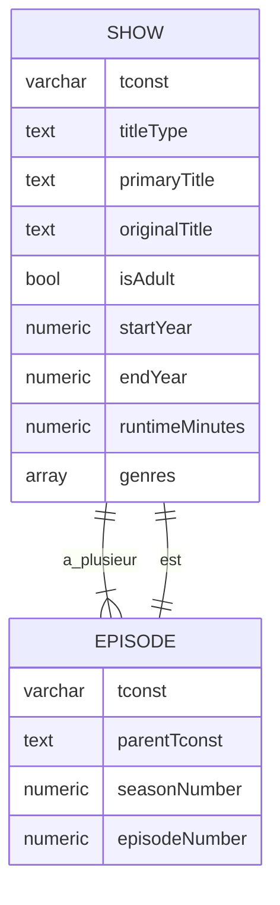

# Quelques astuces postgresql 

Quelque petit truc utils en postgresql dans le dév de tous les jours : 

 1. faire de la recherche full text + colonne calculée
 2. faire des upsert
 3. requêter les données en JSON
 4. récupérer les données générées lors d'un insert ou d'un update
 5. select for update  
 6. gérer les migrations: table tmp, not valid, concurrently 


## Data set 

Data set IMDB avec la liste des films, series, acteurs

Imdb : 
 * https://www.imdb.com/interfaces/
 * https://datasets.imdbws.com/

## Modèle : 



## 1 Les colonnes générées et la recherche full text


```sql
alter table show
    add column "nameIndex" tsvector
        GENERATED ALWAYS AS (to_tsvector('english', "primaryTitle") || to_tsvector('english', "originalTitle") ) stored;

create index show_name_index_idx on show using gin("nameIndex");
```

Recherche "full text" sur la colonne calculée :  

```sql
select *
from show s
where
s."nameIndex" @@ plainto_tsquery('english', 'chainsaw man')
and s."titleType" = 'tvSeries';
```

Si on met à jour un des 2 champs texte, ça met à jour la colonne calculée : 

```sql 
update show
set "primaryTitle" = 'Edgar Allan Poooo'
where tconst = 'tt0000854';
```


## 2 Les upsert

On crée une table de search dédiée à la recherche full text. 

 * `tconst` est la clé primaire mais aussi une foreign key vers l'id du show
 * `on delete cascade` : si un show est supprimé alors show_search le sera aussi 

```sql
create table show_search(
    "tconst" varchar(100) primary key references show("tconst") on delete cascade,
    search tsvector
);
create index show_search_search_idx on show_search using gin("search");
```

On peut initialiser cette table en utilisant "insert select" : 

```sql
insert into show_search
select
    "tconst",
    to_tsvector('english', "primaryTitle") || to_tsvector('english', "originalTitle") as search
from show;
```

`9,379,384 rows affected in 4 m 54 s 162 ms` 

Maintenant on veut mettre à jour un index pour un id, mais comment savoir si la ligne existe déjà ? 

```sql
insert into show_search
select
    "tconst",
    to_tsvector('english', "primaryTitle") || to_tsvector('english', "originalTitle") as search
from show
where tconst = 'tt0089530'
on conflict ("tconst")
    do update set search = excluded.search;
```

Depuis postgresql 15, il existe `MERGE` mais pour le moment, je n'ai pas testé.  

## 3 returning 

On ajoute des colonnes qui seront gérées par la base :
```sql 
alter table show add column if not exists "createdAt" timestamp;
alter table show add column if not exists "updatedAt" timestamp;
```

L'idée, c'est de pouvoir faire un upsert et de pouvoir avoir les valeurs générées par la base en retour. 

Dans cette requête, `createdAt` et `updatedAt` sont valorisée lors d'un insert, mais lors d'un update, seulement `updatedAt` est mis à jour : 

```sql
insert into show(
   "tconst",
   "titleType",
   "primaryTitle",
   "originalTitle",
   "isAdult",
   "startYear",
   "endYear",
   "runtimeMinutes",
   "genres",
   "createdAt",
   "updatedAt"
) values
   ('tt0008529','movie','Sacrifice','Sacrifice',false,1917, null ,50, '{"Drama","War"}'::text[], now(), now())
   on conflict ("tconst")
do update set
   "titleType" = excluded."titleType",
   "primaryTitle" = excluded."primaryTitle",
   "originalTitle" = excluded."originalTitle",
   "isAdult" = excluded."isAdult",
   "startYear" = excluded."startYear",
   "endYear" = excluded."endYear",
   "runtimeMinutes" = excluded."runtimeMinutes",
   "genres" = excluded."genres",
   "updatedAt" = now()
returning show.*;
```

En utilisant `returning show.*` toutes les colonnes de la ligne mise à jour de show sont retournée. 

On peut aussi utiliser `returning row_to_json(show)` pour avoir le résultat en json. 

Si on expose une API ainsi : 

```java

 @PutMapping("/api/shows/{id}")
 public Mono<Movie> putMovie(@PathVariable("id") String id, @RequestBody UpsertMovie movie) {
     return binder(client
             .sql("""
                     insert into show(
                         "tconst",
                         "titleType",
                         "primaryTitle",
                         "originalTitle",
                         "isAdult",
                         "startYear",
                         "endYear",
                         "runtimeMinutes",
                         "genres",
                         "createdAt",
                         "updatedAt"
                     ) values              
                           ($1, $2, $3, $4, $5, $6, $7 , $8, $9::text[], now(), now())
                     on conflict ("tconst")
                         do update set
                           "titleType" = excluded."titleType",
                           "primaryTitle" = excluded."primaryTitle",
                           "originalTitle" = excluded."originalTitle",
                           "isAdult" = excluded."isAdult",
                           "startYear" = excluded."startYear",
                           "endYear" = excluded."endYear",
                           "runtimeMinutes" = excluded."runtimeMinutes",
                           "genres" = excluded."genres",
                           "updatedAt" = now()
                     returning row_to_json(show)
                     """)
     )
             .bind("$1", id, String.class)
             .bind("$2", movie.titleType(), String.class)
             .bind("$3", movie.primaryTitle(), String.class)
             .bind("$4", movie.originalTitle(), String.class)
             .bind("$5", movie.isAdult(), Boolean.class)
             .bind("$6", movie.startYear(), Integer.class)
             .bind("$7", movie.endYear(), Integer.class)
             .bind("$8", movie.runtimeMinutes(), Integer.class)
             .bind("$9", movie.genres().toArray(String[]::new), String[].class)
             .get()
             .map(r -> r.get(0, String.class))
             .one()
             .flatMap(json -> {
                 try {
                     return Mono.just(mapper.readValue(json, Movie.class));
                 } catch (JsonProcessingException e) {
                     return Mono.error(e);
                 }
             });
 }
```

Et qu'on fait le PUT suivant, en retour, on aura bien les dates générées 

```bash
curl -XPUT 'http://localhost:8080/api/shows/tt13616990' -H 'content-type: application/json' -d '{
  "endYear": null,
  "isAdult": false,
  "startYear": 2022,
  "titleType": "tvSeries",
  "primaryTitle": "Chainsaw Man",
  "originalTitle": "Chainsaw Man",
  "runtimeMinutes": null,
  "genres": [
    "Action",
    "Adventure",
    "Animation"
  ]
}' 
```

## 4 select en json 

L'intérêt du select en json c'est de pouvoir facilement parser le résultat en java. On peut dans le select récupérer un grape de données complète. 

Ici, on va récupérer le show et les episodes du show, s'ils existent. Pour récupérer les épisodes, on va faire un select dans le select. 
L'intérêt est de complétement séparer ce qui de l'ordre du filtre : les shows que je veux trouver, et ce qui de l'ordre des données retournées : le détail du show et de ses épisodes. 

Par exemple avec la requête suivante : 

```sql
select 
    s, -- les données du show 
    array (select e -- ici on fait un select dans le select pour obtenir les episodes du show 
      from episode ep
      join show e on ep."tconst" = e.tconst
      where ep."parentTconst" = s.tconst -- on retrouve tous les épisodes qui ont "s" comme parent.
    )
-- à partir de la, on est sur la partie filtre des lignes 
from show s
join show_search ss on s.tconst = ss.tconst
where
   ss."search" @@ plainto_tsquery('chainsaw man') -- on récupère le show "chainsaw man" 
   and s."titleType" = 'tvSeries';
```

Maintenant on ajoute du json 

```sql
select row_to_json(s)::jsonb || -- s est transformé en json, le || permet de merger 2 json  
    json_build_object('episodes', array( -- on créé un object json qui a une clé 'episodes' dont la valeur est un tableau de json  
       select row_to_json(e)::jsonb || row_to_json(ep)::jsonb -- chaque élément du tableau est le show de l'épisode + l'épisode. 
       from episode ep
       join show e on ep."tconst" = e.tconst
       where ep."parentTconst" = s.tconst
   ))::jsonb
from show s
join show_search ss on s.tconst = ss.tconst
where ss."search" @@ plainto_tsquery('game throne')
  and s."titleType" = 'tvSeries'
limit 50;
```

Exemple dans une API : 

```java

 @GetMapping("/api/shows")
 Flux<Movie> listMovies(@RequestParam(name = "page", defaultValue = "1") Integer page,
                        @RequestParam(name = "size", defaultValue = "20") Integer size,
                        @RequestParam(name = "type", required = false) TitleType showType,
                        @RequestParam(name = "title", required = false) String title) {
     Integer offset = (page - 1) * size;

     var conditions = conditions(
             Optional.ofNullable(showType).map(t -> cond("s.\"titleType\" = %s", t.value)),
             Optional.ofNullable(title).map(t -> cond("ss.\"search\" @@ plainto_tsquery('english', %s )", t))
     );

     return conditions.bindTo(client.sql("""
                                 select row_to_json(s)::jsonb || json_build_object('episodes', array(
                                     select row_to_json(e)::jsonb || row_to_json(ep)::jsonb
                                     from episode ep
                                     join show e on ep."tconst" = e.tconst
                                     where ep."parentTconst" = s.tconst
                                 ))::jsonb
                                 from show s
                                 join show_search ss on s.tconst = ss.tconst
                                  %s
                                 offset %s
                                 limit %s
                             """.formatted(
                             conditions.sqlClauseWithWhere(),
                             conditions.index(1),
                             conditions.index(2)
                     )
             ))
             .bind(conditions.index(1), offset)
             .bind(conditions.index(2), size)
             .map(r -> r.get(0, String.class))
             .all()
             .flatMap(json -> {
                 try {
                     return Mono.just(mapper.readValue(json, Movie.class));
                 } catch (JsonProcessingException e) {
                     return Mono.error(e);sle
                 }
             });
 }
```

```bash
curl -XGET 'http://localhost:8080/api/shows?size=5&type=TVSERIES&title=chainsaw%20man' | jless
```

## 5 select for update

le `select for update` permet de comme son nom l'indique, de sélectionner dans l'idée de mettre à jour. 
Les lignes sélectionnées vont être lockées et ne pourront pas être accessible par d'autres.

Il existe 3 stratégies : 

1. `select * from ... for update` : dans ce cas on va attendre si les lignes requêtées sont déjà utilisées
2. `select * from ... for update skip locked` : dans ce cas si des lignes sont déjà utilisées, les lignées lockées seront ignorées dans ce select
3. `select * from ... for update no wait` : dans ce cas une erreur sera retournée

le select for update est à utiliser avec précaution, on voit vite les problèmes que ça pourrait entrainer. 
Un use case, c'est par exemple pour gérer des jobs dans un contexte ou notre application a plusieurs instances. 
Pour éviter que les jobs soient executés autant de fois que d'instance d'appli, on peut utiliser le select for update pour gérer un singleton.   


## 6 stratégies de migration 

Quand on doit faire évoluer nos modèles de données sans interruption de service, il y a quelque précautions à prendre. 

### Créer un index 

La création d'index pose un lock sur la table entière. Une solution pour éviter ce problème, c'est le mot clé `concurrently`.

```sql
create index concurrently if not exists episode_tconst_idx on episode(tconst);
```

**Attention** : `concurrently` ne fonctionne pas dans une transaction et il ne faut donc pas mettre ça des scripts liquibase par exemple. 

### Foreign key 

Déclarer une foreign key sur des données existantes, peut aussi poser problème. Un lock est posé sur la table et si il y a du volume ça peut prendre énormément de temps, car toutes les données vont être analysées. 
Si on sait que les données sont propres, on peut utiliser le mot clé `not valid`. 

```sql
ALTER TABLE episode 
    ADD CONSTRAINT episode_parenttconst_fk 
        FOREIGN KEY ("parentTconst") REFERENCES show("tconst") 
            ON DELETE CASCADE ON UPDATE NO ACTION not valid;
```

Ceci va skipper l'analyse des données existantes, la contrainte sera validée sur les prochaines mises à jour. 

Si on veut pouvoir passer les scripts plusieurs fois et donc éviter une erreur si la contrainte existe déjà, on peut faire comme ça : 

```sql
DO $$ BEGIN
IF NOT EXISTS (SELECT FROM pg_constraint WHERE conname = 'episode_parenttconst_fk') THEN
ALTER TABLE episode
    ADD CONSTRAINT episode_parenttconst_fk
        FOREIGN KEY ("parentTconst") REFERENCES show("tconst")
            ON DELETE CASCADE ON UPDATE NO ACTION not valid;
END IF;
END $$;
```

### Ajouter une colonne et valoriser une donnée

Si on veut ajouter une colonne et valoriser cette colonne sur une table à gros volume il est probablement préférable de passer par une table intermédiaire. 

1. Sur la table d'origine, on va renommer tous les index en `{INDEX}_TMP`. 
2. on va créer une table temporaire qui est la table d'origine avec la colonne supplémentaire. 
3. on peuple la table temporaire en faisant un `insert into table_tmp select ... from table`
4. comme des données ont pu être mise à jour entre temps, dans une même transaction, on va 
    * mettre à jour les dernières données `insert into table_tmp select ... from table where updated > now() - '1 hour'::interval on confict do update ...`
    * renommer la table d'origine en `table_old` par exemple 
    * renommer la table `table_tmp` en `table`
    * on commit bien sur 

Avec cette méthode, pas d'interruption de service. 

## Jouer avec le projet 

### Lancer la base

```
docker-compose up
```

### Lancer l'application

```
./gradlew bootRun
```

Le lancement de l'app va démarrer le serveur et initialiser les tables de la BDD à partir de `src/main/resources/schema.sql`.

### Set up des données 

Se connecter sur le container pour utiliser copy :

```
docker-compose exec tips_postgres bash
```


Créer des tables tmp pour pouvoir retravailler les données

```sql
create table if not exists show_import(
   "tconst" varchar(100) primary key,
   "titleType" text,
   "primaryTitle" text,
   "originalTitle" text,
   "isAdult"	bool,
   "startYear" numeric,
   "endYear" numeric,
   "runtimeMinutes" numeric,
   "genres" text
);
create table if not exists people_import(
    "nconst" varchar(100) primary key,
    "primaryName" text,
    "birthYear" numeric,
    "deathYear" numeric,
    "primaryProfession" text,
    "knownForTitles" text
);
create table if not exists episode_import(
    "tconst"	varchar(100),
    "parentTconst" varchar(100),
    "seasonNumber" numeric,
    "episodeNumber" numeric
);
create table if not exists show_crew_import(
    "tconst"	varchar(100),
    "ordering" numeric,
    "nconst" varchar(100),
    "category" text,
    "job" text,
    "characters" text
);
```

Sur le container :
```
PGPASSWORD="movies" psql -h localhost -p 5432 -U movies -d movies -c "\copy show_import from '/home/pg/title.basics.tsv' with NULL '\N' DELIMITER E'\t' CSV HEADER QUOTE E'\b';"
```

```sql
insert into show("tconst","titleType","primaryTitle","originalTitle","isAdult","startYear","endYear","runtimeMinutes", "genres")
 select "tconst","titleType","primaryTitle","originalTitle","isAdult","startYear","endYear","runtimeMinutes", string_to_array("genres", ',')
 from show_import;

drop table show_import;
```

```
PGPASSWORD="movies" psql -h localhost -p 5432 -U movies -d movies -c "\copy people_import from '/home/pg/name.basics.tsv' with NULL '\N' DELIMITER E'\t' CSV HEADER QUOTE E'\b';"
```

```sql
insert into people(
    "nconst",
    "primaryName",
    "birthYear",
    "deathYear",
    "primaryProfession",
    "knownForTitles"
) select "nconst",
         "primaryName",
         "birthYear",
         "deathYear",
         "primaryProfession",
         string_to_array("knownForTitles", ',')
from people_import;

drop table people_import;

```

```
PGPASSWORD="movies" psql -h localhost -p 5432 -U movies -d movies -c "\copy episode_import from '/home/pg/title.episode.tsv' with NULL '\N' DELIMITER E'\t' CSV HEADER QUOTE E'\b';"
```

```sql
insert into episode(
    "tconst",
    "parentTconst",
    "seasonNumber",
    "episodeNumber"
)
select "tconst",
       "parentTconst",
       "seasonNumber",
       "episodeNumber"
from episode_import
where
    exists(select from show where show."tconst" = episode_import."tconst") and
    exists(select from show where show."tconst" = episode_import."parentTconst")
;
```

```
PGPASSWORD="movies" psql -h localhost -p 5432 -U movies -d movies -c "\copy show_crew_import from '/home/pg/title.principals.tsv' with DELIMITER E'\t' CSV HEADER QUOTE E'\b';"
```

```sql
insert into show_crew("tconst", "ordering", "nconst", "category", "job", "characters")
select "tconst", "ordering", "nconst", "category", "job", string_to_array("characters", ',')
from show_crew_import
where
    exists(select from show where show."tconst" = show_crew_import."tconst") and
    exists(select from people where people."nconst" = show_crew_import."nconst")
```
